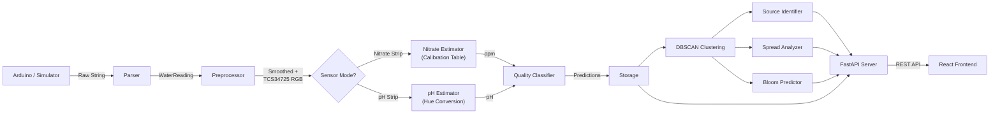

# Water Quality Monitoring System — Complete Feature Overview

## Architecture



---

## Backend (Python)

### 1. Data Simulator (`simulator/data_simulator.py`)
- Emulates an Arduino with water quality sensors
- Generates realistic correlated values using random-walk algorithms
- **Sensors simulated**: Temperature (20-35°C), TDS (200-1000 ppm), Turbidity (1-5 NTU), Water Level (0-500 mm), GPS with slight drift, RGB color strip
- Outputs exact format: `T:28.5;TDS:320;TURB:2.1;LEVEL:380;LAT:12.971;LON:77.594;RGB:120,98,76`

### 2. Parser (`parser/water_parser.py`)
- Converts raw semicolon-delimited sensor strings into structured `WaterReading` dataclass objects
- Handles malformed input gracefully — bad fields get `None` instead of crashing
- Supports JSON serialization for API output

### 3. Preprocessor (`preprocessing/preprocessor.py`)
- Moving-average filter for noisy TDS and Turbidity streams
- Configurable window size (default 5 readings)
- RGB normalization to [0,1] range for ML model input

### 4. Nitrate Calibration Estimator (`models/nitrate_model.py`)
- **RandomForestRegressor** trained on 2000 synthetic TCS34725 readings
- Pipeline: `TCS34725 RGB → Calibration Table Matching → Interpolation → Nitrate (ppm)`
- Calibration table derived from real Griess reaction photochemistry (18 reference points)
- Maps TCS34725 color sensor readings to nitrate concentration via learned calibration surface
- Includes `_find_nearest_calibration_point()` for diagnostic calibration region identification

### 4b. pH Colorimetric Estimator (`models/ph_model.py`)
- **RandomForestRegressor** trained on 2000 synthetic TCS34725 readings with hue-augmented features
- Pipeline: `TCS34725 RGB → Hue Conversion → Color Reference Mapping → pH Estimation`
- Color reference table derived from Merck universal indicator + BTB (18 reference points)
- Feature vector: `[R, G, B, Hue]` — the Hue channel encodes the indicator's color transition
- Hue extraction via RGB→HSV conversion provides a near-monotonic mapping to pH

### 5. Water Quality Classifier (`models/quality_classifier.py`)
- **RandomForestClassifier** trained on 3000 samples
- Input: TDS, Turbidity, Nitrate, Temperature
- Output: **Safe** / **Moderate** / **Unsafe** label
- Rules: Unsafe if TDS>700 or Turb>3.5 or Nitrate>25; Moderate if TDS>400 or Turb>2; else Safe

### 6. Hotspot Detector (`clustering/hotspot_detector.py`)
- **DBSCAN** clustering on GPS coordinates
- For each cluster computes: centroid (mean lat/lon), affected radius (max distance), severity (based on avg TDS+Turbidity+Nitrate), reading count

### 7. Source Identifier (`clustering/source_identifier.py`)
- Uses **OpenStreetMap Nominatim** reverse geocoding
- Maps land-use features near a cluster centroid to pollution source types:
  - Industrial area → "Industrial Discharge"
  - Residential → "Sewage Contamination"  
  - Farmland → "Agricultural Runoff"
  - Unknown → "Unknown"

### 8. Spread Analyzer (`clustering/spread_analyzer.py`)
- Tracks how a cluster's centroid moves over time
- Splits readings into two time halves, computes centroid drift
- Outputs: spread direction (N/NE/E/SE/S/SW/W/NW) and speed (km/h)

### 9. Bloom Predictor (`clustering/bloom_predictor.py`)
- Rule-based algal bloom risk assessment:
  - **HIGH**: Nitrate > 25 ppm AND Temperature > 30°C
  - **MODERATE**: Nitrate > 12 ppm
  - **LOW**: Everything else

### 10. FastAPI Server (`api/server.py`)
- 4 REST endpoints:

| Endpoint | Method | Returns |
|----------|--------|---------|
| `/data` | GET | Latest processed reading with all ML predictions |
| `/history?n=50` | GET | Last N readings as array |
| `/clusters` | GET | DBSCAN clusters with source, spread direction, GeoJSON |
| `/alerts` | GET | Quality and bloom alerts with severity badges |

### 11. Main Orchestrator (`main.py`)
- Background thread runs the calibration-based sensing pipeline every 2 seconds
- TCS34725 color sensor alternates: pH indicator strip (even minutes) ↔ Nitrate Griess strip (odd minutes)
- Flow: Sensor → Parse → Preprocess (TCS34725 normalise + Hue extract) → Calibration Estimation → Classify Quality → Predict Bloom → Store → Cluster → Identify Source → Analyze Spread
- Starts Uvicorn server on port 8000

---

## Frontend (React + Vite)

### Global Features
- **Header Bar** — visible on every page:
  - Animated circular **River Health Score** ring (recalculated every 4 seconds from live sensor data)
  - **Active alerts count** with blinking red dot when alerts > 0
  - **Dominant pollution source** label from cluster analysis
  - **Last updated** timestamp that ticks live
- **Sidebar Navigation** — organized into sections: Main, Intelligence, System
- **Dark theme** — deep blacks (#0a0a0a, #0d1117) with Inter + JetBrains Mono fonts

---

### Page 1: Dashboard (`/`)

**Purpose**: System overview at a glance

**Features**:
- **Live Data Pipeline Visualization** — an animated SVG showing data flowing through 6 stages (Sensors → Parser → Preprocess → ML Models → Clustering → API). Dots animate along the pipeline, and each node lights up as data passes through it
- **Health Score Ring** — large animated circular progress showing overall water quality (0-100). Color shifts from green (>70) to amber (>40) to red (<40)
- **4 Metric Cards with Sparklines** — TDS, Turbidity, Nitrate, Temperature. Each card shows:
  - Current value with **animated counter** (smooth easeOutCubic transition when value changes)
  - Unit label
  - **Mini sparkline chart** showing last 30 readings trend
- **Bottom row**: Water Level with progress bar, Quality badge, Bloom Risk badge, Active Alerts count, Cluster count
- **Session Uptime Timer** — running clock showing how long the system has been active

---

### Page 2: Live Data (`/live`)

**Purpose**: Real-time sensor readings with visual gauges

**Features**:
- **5 SVG Arc Gauges** — semicircular gauge for each sensor (TDS, Turbidity, Nitrate, Temperature, Water Level):
  - Animated arc that smoothly grows/shrinks as values change
  - **Danger detection** — arc turns red when value exceeds safety threshold (TDS>700, Turbidity>3.5, Nitrate>25)
  - Numeric value displayed in center with mono font
  - Percentage fill bar below each gauge
  - Hover effect on each card
- **GPS Position** — live latitude/longitude display
- **RGB Color Swatch** — shows actual color from the nitrate strip sensor with individual R/G/B values, smooth color transition animation
- **Quality & Bloom Badges** — color-coded status labels
- **Refresh Counter** — shows how many data refreshes have occurred
- Auto-refreshes every 2 seconds with smooth value transitions (no flicker)

---

### Page 3: History (`/history`)

**Purpose**: Historical data analysis with charts

**Features**:
- **Time Range Filter** — buttons to select Last 20/50/100/200/500 readings
- **Metric Filter** — toggle which metrics to show on the chart (All, TDS, Turbidity, Nitrate, Temperature). Each has a color dot indicator
- **Interactive Line Chart** (Recharts):
  - Multiple lines with different colors per metric
  - Custom dark tooltip showing all values
  - Smooth 600ms animation when data changes
  - Chart re-animates with `fadeSlideUp` CSS when filter changes
- **Data Table** — scrollable table with all readings:
  - Columns: Time, Temp, TDS, Turb, Level, Nitrate, Quality, Bloom
  - Quality/Bloom shown as color-coded badges
  - Row highlight on hover
- **Refresh button** and reading count indicator

---

### Page 4: Pollution Analysis (`/pollution`)

**Purpose**: Unified pollution source identification (merges 3 original pages)

**Has 3 internal tabs**:

#### Tab 1: River Map
- **Full SVG river visualization** — a winding river path rendered with multiple layers (shadow, body, surface highlight, animated flow lines)
- **14 sensor points** along the river — each is a pulsing animated circle color-coded by severity:
  - Red = high, Amber = moderate, Green = low
  - Pulse animation speed and radius varies per point
  - Click any point to see its details in the side panel
- **4 pollution source icons** — Factory, Farm, Sewage Plant, Landfill — each drawn as an SVG icon with unique shape and color
- **Animated connection lines** — dashed lines from each sensor point to its identified source, with flowing dash animation showing pollution traveling from source to river
- **Pollution plumes** — radial gradient ellipses at each contaminated point:
  - LINEAR spread = elongated ellipse along river
  - CONCENTRATED = tight radial hotspot
  - DIFFUSE = wide scattered haze
  - All plumes pulse/breathe with subtle opacity animation
- **Detail Panel** (right side) — click a point to see: GPS, TDS, Turbidity, Nitrate, Temperature, Water Level, RGB swatch, Cluster ID, Spread pattern, Linked source

#### Tab 2: Source Details
- **4 entity cards** — one per source type (Factory, Farm, Sewage, Landfill):
  - Custom SVG icon matching source type
  - Source name and description
  - **Waste product tags** — color-coded chips showing what each source produces (e.g., Factory → Heavy metals, Solvents, Heat discharge, Acidic runoff)
  - Linked sensor reading count
  - Hover effect with border glow matching source color

#### Tab 3: Fingerprint Analysis
- **Grouped Bar Chart** — compares pollution contribution across 5 parameters (Nitrate, TDS, Turbidity, Heavy Metals, Pathogens) for all 4 source types. Animated bars grow on load (1200ms)
- **Radar/Spider Chart** — overlays pollution fingerprints of all 4 sources on one chart. Visually shows which source dominates which parameter. Semi-transparent fills with colored strokes

**Quick Stats Bar** at top showing: total sensor points, critical/warning/normal counts, live cluster count

---

### Page 5: Spread Tracker (`/spread`)

**Purpose**: Track how pollution moves and simulate future spread

**Has 2 internal tabs**:

#### Tab 1: Live Tracking
- **Dark Leaflet Map** with CARTO dark tiles
- **Auto-fit** to cluster bounds on first load
- **Reading dots** — all recent readings shown as small translucent dots
- **Cluster zones** — dashed circle boundaries with severity-colored fill
- **Cluster center markers** — solid colored dots at each centroid
- **Direction arrows** — polylines showing spread direction from each cluster, with arrowhead marker at the endpoint
- **Clickable clusters** — click a zone to highlight its details
- **Side Panel** — shows all detected clusters with:
  - Severity badge
  - Spread direction and speed
  - Probable source type
  - Affected radius
  - Active selection highlighting with colored border

#### Tab 2: Spread Simulation
- **Full SVG river animation** with:
  - Multi-layered river (shadow, body, highlight, 2 animated flow lines at different speeds)
  - **30 floating water particles** — tiny dots that drift along the river with wobble animation, giving the river a "living" feel
- **Timeline Controls**:
  - **Play/Pause** button (toggles)
  - **Reset** button (returns to 0h)
  - **Speed selector** — 1x, 2x, 4x playback speeds
  - **Timeline slider** — drag from 0h to 72h
  - Large time display showing current hour in risk-colored font
- **Pollution Plumes** that grow with time:
  - Each plume uses easeInOutQuad easing for smooth growth
  - LINEAR plumes stretch downstream
  - CONCENTRATED plumes grow radially
  - DIFFUSE plumes expand as wide hazes
  - Plumes pulse/breathe with subtle opacity animation
- **Merge Zones** — after 20+ hours, nearby plumes merge into larger contamination zones
- **Connection lines** — appear progressively as simulation advances, showing source-to-river pollution paths
- **Source icons** on the map with labels
- **Clickable sensor points** — click to see detail in side panel
- **Right Stats Panel**:
  - Risk level badge (LOW → MODERATE → HIGH → CRITICAL) that changes with time
  - Affected river length (km)
  - Danger and warning point counts
  - Contamination percentage
  - Selected point detail card

---

### Page 6: Bloom Intelligence (`/bloom`)

**Purpose**: Algal bloom risk assessment and prediction

**Features**:
- **Critical Flashing Banner** — when risk reaches ALERT or CRITICAL, a red pulsing banner appears at the top showing the warning message and affected coordinates
- **Hero Risk Card** — large card with:
  - **Ripple animation** — concentric circles expanding outward from center, colored by risk level (green/amber/red)
  - Risk level text (LOW/MODERATE/HIGH) with pulsing animation on HIGH
  - Background gradient shifts color based on risk
- **Prediction Gauge** — animated SVG semicircle speedometer:
  - 5 color segments (green → red)
  - Animated needle that swings to current position
  - Risk label (NO RISK / WATCH / WARNING / ALERT / CRITICAL)
  - Confidence percentage
- **Quick Metrics Grid** — Nitrate level, Temperature, Green Channel intensity, Combined Risk Score — values turn red when exceeding thresholds
- **Reaction Scatter Chart** — plots Nitrate (x-axis) vs Green Channel intensity (y-axis):
  - Each dot is a bubble **sized by temperature**
  - **Colored by bloom risk** — blue (safe) → teal (watch) → bright green (danger)
  - Red dashed **threshold line** — points above are in the danger zone
  - Shows correlation between nutrient levels and algal growth indicators
- **Nitrate vs Temperature Trend Chart** — dual-axis line chart showing how both parameters correlate over time. Uses live data from backend
- **3 Synced Parameter Charts** — Nitrate, Temperature, and Green Channel intensity over time (48-hour synthetic series), each with a red threshold reference line
- **Assessment Rules** — inline reference showing the bloom classification rules

---

### Page 7: Overview Map (`/map`)

**Purpose**: Full map view of all clusters and readings

- Dark Leaflet map with cluster zones, reading markers, and GeoJSON visualization
- Popup details on click

---

### Page 8: Alerts (`/alerts`)

**Purpose**: Alert feed from the system

- Color-coded alert items (quality warnings, bloom risks)
- Severity badges
- Auto-refresh every 5 seconds

---

## Configurable Location Source & GPS Fallback

The system supports a configurable location source. When live GPS data is unavailable, the platform automatically falls back to predefined coordinates to ensure uninterrupted map visualization and location-based analysis.

- **Location Source Priority**:
  1. **GPS Coordinates** (when available and valid)
  2. **Configured Demo Coordinates** (fallback, via `DEMO_LATITUDE` / `DEMO_LONGITUDE` environment variables on the backend, or `VITE_DEMO_LATITUDE` / `VITE_DEMO_LONGITUDE` on the frontend)
  3. **Existing hardcoded values** (last resort, default to Bangalore center: `12.9716, 77.5946`)

- **Centralized Providers**:
  - **Backend**: `utils/location_provider.py` manages active coordinates dynamically for simulator drift and serial fallback coordinates.
  - **Frontend**: `frontend/src/locationProvider.js` manages active coordinates for Leaflet maps, synthetic data offset calculations, and fallback cluster centers.

---

## How to Run

```bash
# Terminal 1: Backend
cd d:\IDP
pip install -r requirements.txt
python main.py
# → API at http://localhost:8000

# Terminal 2: Frontend  
cd d:\IDP\frontend
npm install
npm run dev
# → UI at http://localhost:5173
```

---

## Tech Stack

| Layer | Technology |
|-------|-----------|
| Backend | Python, FastAPI, Uvicorn |
| ML | scikit-learn (RandomForest) |
| Clustering | DBSCAN (scikit-learn) |
| Geocoding | OpenStreetMap Nominatim |
| Frontend | React 19, Vite 8 |
| Charts | Recharts |
| Maps | React-Leaflet + CARTO dark tiles |
| Animations | CSS keyframes + React state + requestAnimationFrame |
| Fonts | Inter, JetBrains Mono (Google Fonts) |
